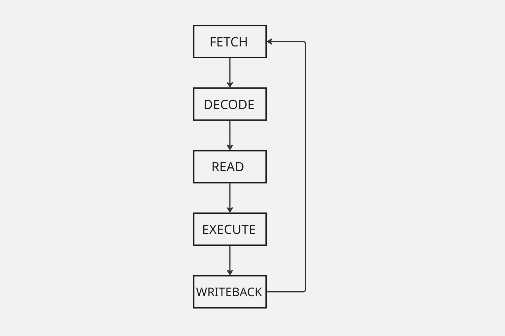

# SimpleCPU — 8-bit CPU from Scratch


> A custom 8-bit multi-cycle CPU designed in Verilog, featuring a custom ISA, Python assembler, FPGA implementation, UART debug system, and host-side debugger.

---

## Project Status

**Completed / Archived**

SimpleCPU is a completed personal hardware project. Development has concluded, and this repository preserves the final implementation.

---

## Overview

SimpleCPU is an **8-bit processor designed and implemented from scratch in Verilog**.

The project began as an exploration of computer architecture and digital logic, starting with individual hardware components and eventually becoming a complete processor capable of running programs on a physical FPGA.

The final system consists of:

```text
Assembly Program
       │
       ▼
 Python Assembler
       │
       ▼
 16-bit Machine Code
       │
       ▼
 Instruction Memory
       │
       ▼
    SimpleCPU
       │
       ▼
Tang Nano 9K FPGA
       │
      UART
       │
       ▼
Python Debugger
```

The CPU was first developed and verified using RTL simulation before being synthesized and deployed to a **Sipeed Tang Nano 9K FPGA**.

A UART-based debugging system was then added, allowing the processor's state to be inspected and controlled from a host computer.

## CPU Specifications


| Component | Specification |
| :--- | :--- |
| Datapath Width | 8-bit |
| Instruction Width | 16-bit |
| Program Counter | 6-bit |
| Instruction Memory | 64 × 16-bit |
| Data Memory | 256 × 8-bit |
| Registers | 8 × 8-bit |
| ALU | 8-bit |
| Architecture | Multi-cycle |
| Control | Finite State Machine |
| Execution States | Fetch → Decode → Read → Execute → Writeback |
| ISA | 16 instructions |
| FPGA | Sipeed Tang Nano 9K |
| FPGA Clock | 27 MHz |
| UART Baud Rate | 115200 |

## CPU Architecture

The processor uses a **multi-cycle architecture** controlled by a finite state machine.

Each instruction progresses through five major states:



## Main Components

- Program Counter
- Instruction Memory
- Instruction Register
- Instruction Decoder
- Register file
- Immediate block
- ALU
- Zero Flag Register
- Data Memory
- Multiplexer
- Writeback MUX
- Multi-Cycle Control Unit

Additionally, FPGA implementation includes:

- UART Receiver
- UART transmitter
- UART Debug Protocol
- Debug Controller
- Debug Interface
- Debug System
- Button Pulse Generator
- FPGA Top-Level Logic

  
## Instruction Set Architecture

This CPU includes a custom **16-instruction ISA**.

| Opcode | Instruction | Description |
| :--- | :--- | :--- |
| `0000` | ADD | Add two registers |
| `0001` | SUB | Subtract two registers |
| `0010` | AND | Bitwise AND |
| `0011` | OR  | Bitwise OR |
| `0100` | XOR | Bitwise XOR |
| `0101` | NOT | Bitwise NOT |
| `0110` | LSL | Logical shift left |
| `0111` | LSR | Logical shift right |
| `1000` | MVI | Move immediate |
| `1001` | STR | Store register to memory |
| `1010` | LDR | Load register from memory |
| `1011` | JMP | Unconditional jump |
| `1100` | CMP | Compare two registers |
| `1101` | BEQ | Branch if equal |
| `1110` | HLT | Halt processor |
| `1111` | BNE | Branch if not equal |

## Assembler

The project includes a custom Python assembler capable of converting assembly programs into the CPU's 16-bit machine code.

## Supported Features

- All 16 CPU instructions
- Register Parsing
- Immediate Values
- Labels
- Comments
- Instruction encoding
- Binary machine-code generation

Example:

```asm
 START:
       MVI R0 10
       MVI R1 20
       MVI R2 0
       ADD R2 R0 R1
       CMP R2 R1
       BNE START
```
The generated machine code can be loaded into the CPU's instruction memory.

## Running the Assembler

```Bash
python Assembler/assembler0.py

```
## Verification

The CPU was rigorously tested and verified using:

- Icarus Verilog
- GTKWave
- Dedicated Verilog testbenches
- Full assembly programs

Testing covered:

- Arithmetic operations
- Logical operations
- Shift operations
- Immediate instructions
- Register reads and writes
- Memory loads
- Memory stores
- Comparisons
- Zero flag behaviour
- Conditional branches
- Unconditional jumps
- HALT behavior
- Program counter operation
- Multi-Cycle control sequencing
- Complete assembly programs

The Processor was first tested in simulation in the above mentioned ways before being moved on a physical FPGA hardware.

## CPU Execution

The waveform below shows the processor executing a complete program while progressing through its multi-cycle control states.


## Final Register State 

The final register state after execution provides a high-level verification of the expected program behavior.

 

## UART Debug System

One of the final stages of the project was adding a hardware debugging interface to the CPU.

The FPGA contains a UART communication system that connects the CPU to a Python debugger running on the host computer.

                 Host Computer
                       │
                       │ UART
                       ▼
              ┌─────────────────┐
              │   UART RX / TX  │
              └────────┬────────┘
                       │
                       ▼
              ┌─────────────────┐
              │ Debug Protocol  │
              └────────┬────────┘
                       │
                       ▼
              ┌─────────────────┐
              │ Debug Controller│
              └────────┬────────┘
                       │
                       ▼
                  SimpleCPU

The debug interface provides access to processor state and allows the CPU to be controlled while running on the FPGA.

Supported functionality includes:

- Run
- Pause
- Clock stepping
- Instruction Stepping
- Program Counter inspection
- Current instruction inspection
- FSM state inspection
- Register inspection

## Python Debugger

A host-side python debugger was developed with AI-assistance to communicate with the CPU over UART.

The debugger includes:

```
  debugger/
  |--- cpu.py
  |--- main.py
  |--- gui.py
```
A GUI version of the debugger is also included.

## Repository structure

```
SimpleCPU/
│
├── Assembler/
│   ├── assembler0.py
│   ├── program.asm
│   ├── output.bin
│   └── bug_fix.bin
│
├── src/
│   ├── CPU.v
│   ├── alu.v
│   ├── control_unit.v
│   ├── regfile.v
│   ├── program_counter.v
│   ├── instruction_memory.v
│   ├── instruction_register.v
│   ├── decoder.v
│   ├── instruction_decoder.v
│   ├── immediate_block.v
│   ├── Data_memory.v
│   ├── flag_register.v
│   ├── writeback_mux.v
│   ├── multiplexer.v
│   ├── mux67.v
│   │
│   ├── fpga_top.v
│   ├── fpga.cst
│   ├── fpga.sdc
│   │
│   ├── uart_rx.v
│   ├── uart_tx.v
│   ├── uart_debug_protocol.v
│   ├── baud_generator.v
│   ├── cpu_uart_debug.v
│   ├── debug_controller.v
│   ├── debug_interface.v
│   ├── debug_system.v
│   └── ...
│
├── debugger/
│   ├── cpu.py
│   ├── main.py
│   ├── gui.py
│   └── serial_test.py
│
├── tb/
│   └── ...
│
├── waves/
│   └── ...
│
├── docs/
│   ├── CPU_overview.jpg
│   ├── execution_overview.png
│   └── final_registers.png
│
├── SimpleCPU_fpga.gprj
├── .gitignore
└── README.md

```

## Development Timeline

The project evolved incrementally from individual digital components into a complete FPGA-based processor.

Stage 1 - Verilog Fundamentals

- Learned Verilog fundamentals
- Built basic combinational

Stage 2 - ALU

- Designed the 8-bit ALU
- Implemented  arithmetic and logical operations

Stage 3 - Registers

- Built individual register modules

Stage 4 - Register File

- Designed the 8-register register file

Stage 5 - Program Counter

- Designed the 6-bit Program Counter

Stage 6 - Instruction Memory

- Added Instruction storage

Stage 7 - Instruction Register 

- Added Instruction capture

Stage 8 - Decoder

- Designed instruction decoding logic

Stage 9 - Control Unit

- Designed multi-cycle FSM

Stage 10 - CPU Integration

- Integrated the complete datapath

Stage 11 - Compare and Flags

- Added CMP
- Added zero flag register

Stage 12 - Branching

- Implemented BEQ
- Implemented BNE
- Implemented JMP

Stage 13 - HALT

- Added processor halt behaviour

Stage 14 - Assembler 

- Developed a custom Python assembler

Stage 15 - Labels

- Added label support

Stage 16 - Full ISA Verification

- Verified all the instructions implemented in the CPU using assembly programs and RTL simulation

Stage 17 - FPGA Implementation

- Synthesized the processor for the tang nano 9k
- Successfully flashed the CPU program to the physical hardware

Stage 18 - UART 

- Added UART RX/TX communication

Stage 19 - Hardware Debugging 

- Implemented the hardware debug protocol
- Added CPU control and state inspection

Stage 20 - Host Debugger

- Developed Python command-line and GUI debugging tools

Stage 21 - Project Completion

- Completed the CPU, assembler, FPGA implementation, UART debug system and host-side debugger
- Archived the project as a finished implementation

## Tools Used

- Verilog HDL
- Python
- Icarus Verilog
- GTKWave
- Gowin EDA
- Sipeed Tang Nano 9k
- VS Code
- Git
- Github


This project grew from individual Verilog modules into a complete system capable of:

Executing custom machine code → running on real FPGA hardware → communicating over UART → being controlled and inspected from a computer.

## Author 

*Shaurya Yadav*

Built from scratch as a personal computer architecture and digital hardware project.


