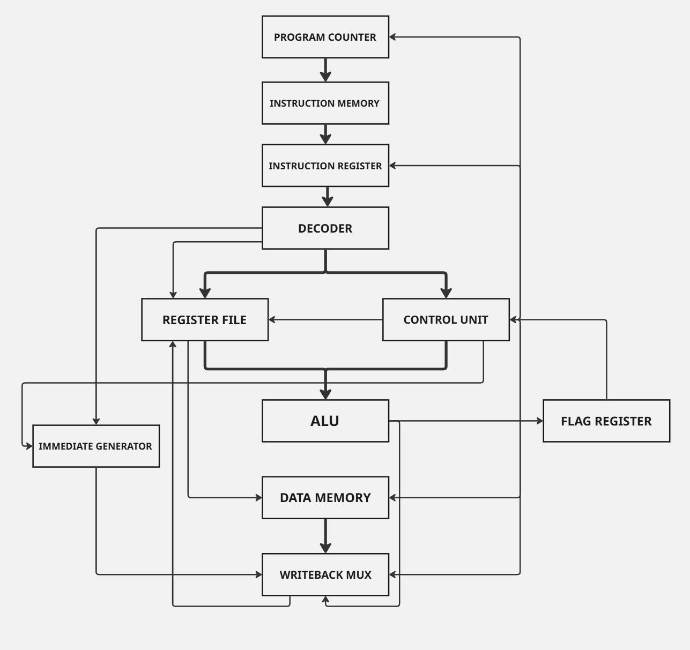
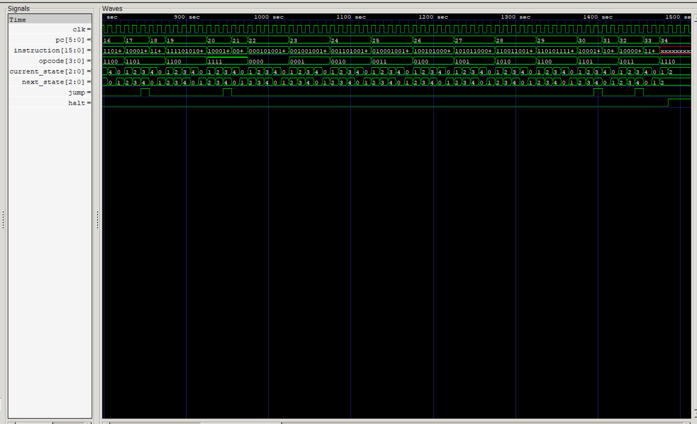
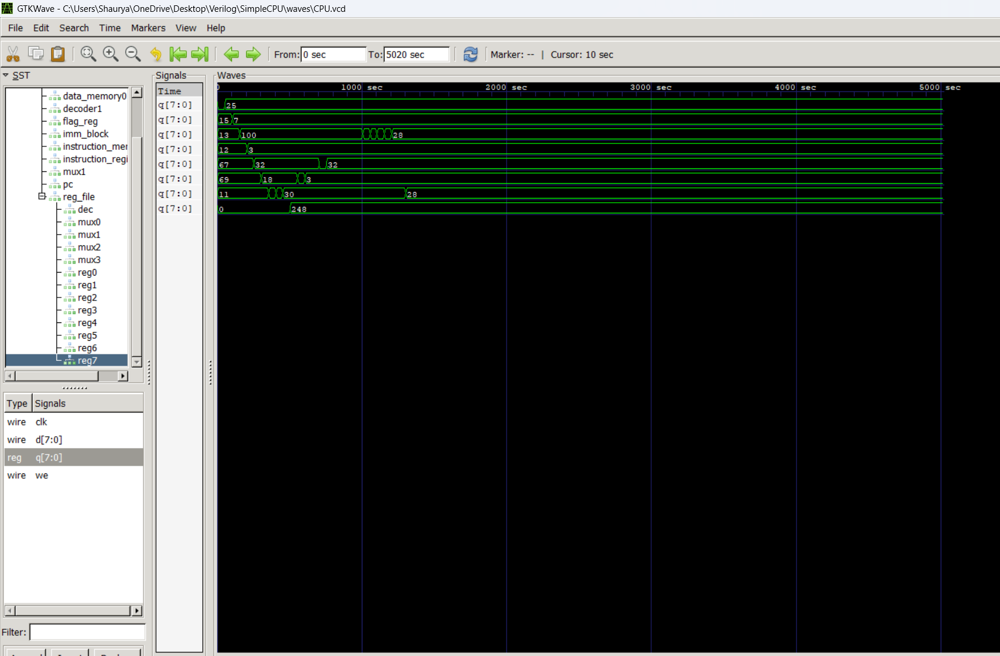

# 8-bit CPU from Scratch



> A custom 8-bit CPU built entirely in Verilog, featuring a custom ISA, assembler, and FPGA target.

---

## Overview

This project documents my journey of designing a simple processor completely from scratch.

The CPU executes a custom **16-instruction ISA**, includes its own **Python assembler**, supports **labels**, and has been extensively verified using **GTKWave** simulations. The next milestone is running the processor on a **Sipeed Tang Nano 9K FPGA**.

This project was built primarily as a learning experience to understand computer architecture beyond simply using HDL.

---

## Features

- Custom 8-bit CPU
- Multi-cycle datapath
- Finite State Machine (Fetch → Decode → Read → Execute → Writeback)
- 8 General Purpose Registers (R0-R7)
- 8-bit ALU
- Instruction Memory
- Data Memory
- Register File
- Program Counter
- Instruction Register
- Immediate Generator
- Zero Flag Register
- Memory Interface
- Custom Python Assembler
- Label support in assembler
- HALT instruction
- Branching support

---

# CPU Specifications

| Component | Specification |
|-----------|---------------|
| Data Width | 8-bit |
| Instruction Width | 16-bit |
| Address Width | 6-bit Program Counter |
| Registers | 8 |
| ALU Width | 8-bit |
| Architecture | Multi-cycle |
| Control | FSM |
| ISA | Custom |

---

# Instruction Set

| Opcode | Instruction | Description |
|---------|------------|-------------|
|0000|ADD|Addition|
|0001|SUB|Subtraction|
|0010|AND|Bitwise AND|
|0011|OR|Bitwise OR|
|0100|XOR|Bitwise XOR|
|0101|NOT|Bitwise NOT|
|0110|LSL|Logical Shift Left|
|0111|LSR|Logical Shift Right|
|1000|MVI|Move Immediate|
|1001|STR|Store Register|
|1010|LDR|Load Register|
|1011|JMP|Jump|
|1100|CMP|Compare|
|1101|BEQ|Branch if Equal|
|1110|HLT|Halt Processor|
|1111|BNE|Branch if Not Equal|

---

# Project Structure

```
Assembler/
    assembler0.py
    program.asm
    output.bin

src/
    CPU.v
    alu.v
    control_unit.v
    regfile.v
    Data_memory.v
    instruction_memory.v
    instruction_register.v
    decoder.v
    immediate_block.v
    program_counter.v
    flag_register.v
    ...

tb/
    CPU_tb.v
    alu_tb.v
    reg_tb.v
    regfile_tb.v
    pgcounter_tb.v

waves/
    *.vcd
```

---

# Assembler

The project includes a custom Python assembler capable of translating human-readable assembly into machine code.

### Supported Features

- Register parsing
- Immediate values
- Labels
- Comments
- Binary output generation

Example:

```asm
START:
    MVI R0 10
    MVI R1 20
    ADD R2 R0 R1
    CMP R2 R1
    BNE START
```

---

# Verification

Every instruction has been verified in simulation using:

- Icarus Verilog
- GTKWave

The CPU has been tested for:

- Arithmetic operations
- Logic operations
- Shift operations
- Immediate loads
- Memory load/store
- Conditional branches
- Unconditional jumps
- HALT operation
- Label resolution
- Register writes
- Flag updates

---

## CPU Execution Overview

The waveform below shows the processor executing a complete assembly program. The Program Counter advances through the instruction stream while the control unit cycles through the five execution states (Fetch → Decode → Read → Execute → Writeback). Conditional branches (`BEQ`, `BNE`), unconditional jumps (`JMP`), and the `HLT` instruction can all be observed.



---

## Final Register State

After executing the test program, the register file contains the expected values, confirming correct execution of arithmetic, logic, memory, and branch instructions.



# Development Timeline

### Stage 1
- Learned Verilog fundamentals
- Built basic combinational circuits

### Stage 2
- Designed ALU

### Stage 3
- Built Register module

### Stage 4
- Built Register File

### Stage 5
- Designed Program Counter

### Stage 6
- Added Instruction Memory

### Stage 7
- Added Instruction Register

### Stage 8
- Built Decoder

### Stage 9
- Designed Control Unit FSM

### Stage 10
- Integrated complete CPU datapath

### Stage 11
- Added Compare instruction

### Stage 12
- Added Zero Flag Register

### Stage 13
- Implemented BEQ

### Stage 14
- Implemented BNE

### Stage 15
- Implemented HALT

### Stage 16
- Wrote custom Python assembler

### Stage 17
- Added label support

### Stage 18
- Full ISA verification

### Stage 19 (Current)
- Preparing FPGA implementation on Tang Nano 9K

---

# Planned Improvements

- [ ] UART interface
- [ ] Memory-mapped I/O
- [ ] LEDs and switches
- [ ] Seven-segment display output
- [ ] Stack Pointer
- [ ] CALL / RET
- [ ] Interrupt support
- [ ] Hardware multiplier
- [ ] Pipeline implementation
- [ ] C compiler backend (long-term)

---

# Tools Used

- Verilog
- Python
- Icarus Verilog
- GTKWave
- VS Code
- Git
- GitHub

---

# Learning Outcomes

Through this project I learned:

- Computer Architecture
- CPU Datapath Design
- Finite State Machines
- Register File Design
- ALU Design
- Memory Interfaces
- Instruction Set Architecture (ISA)
- Assembly Language
- Assembler Design
- Digital Logic
- Hardware Debugging with GTKWave
- Version Control with Git

---

# FPGA Target

Sipeed Tang Nano 9K

The next goal is to synthesize this CPU and run assembly programs directly on hardware.

---

## Author

**Shaurya Yadav**

Built as a personal project to understand how processors work from the transistor abstraction level upward.

